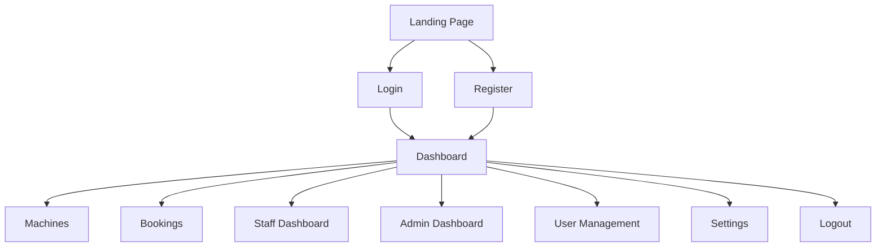
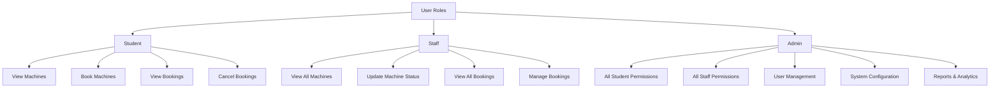
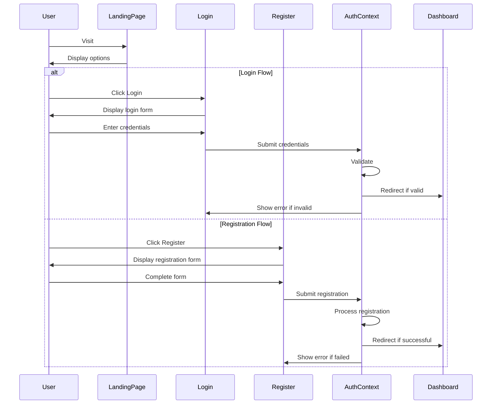
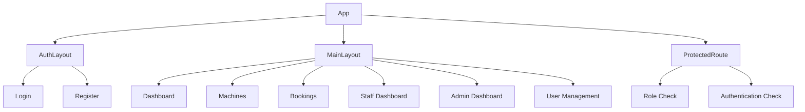
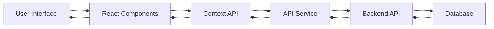
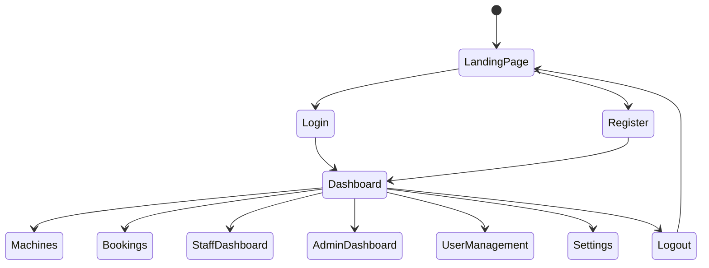
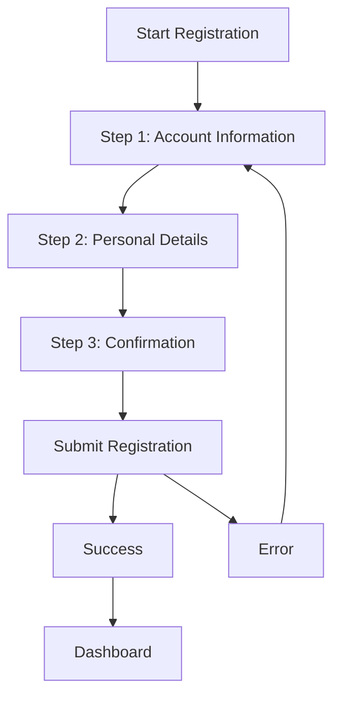
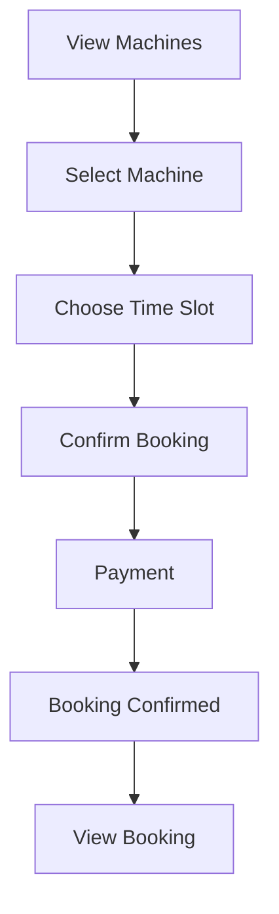
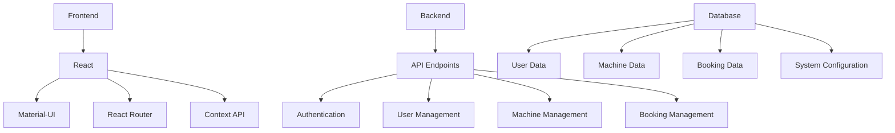

# MNIT Laundry Management System - System Diagram

## 1. Overall System Architecture

## 2. User Roles and Permissions

## 3. Authentication Flow

## 4. Component Structure

## 5. Data Flow

## 6. Navigation Flow

## 7. Registration Process

## 8. Booking Process

## 9. System Components

